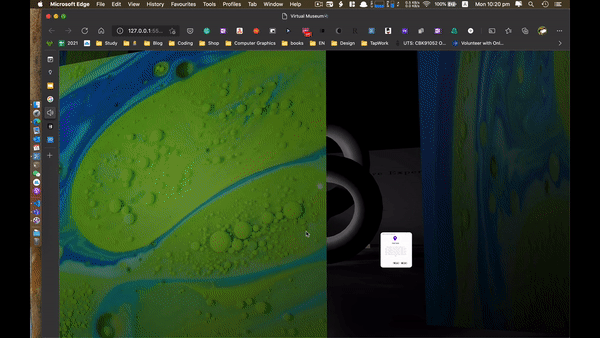
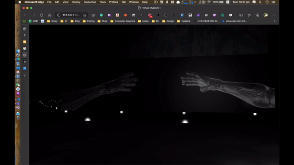
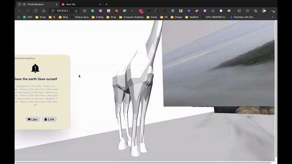

# virtual-museum
> This is an assignment project for Computer Graphics subject in UTS.

- Developed an online web application using three.js 
- Developed a virtual scene that includes a complex light environment and multiple cameras. Created a GUI to control the setting of the environment.
- Created a tool to load 3D objects into the scene using JSON configurations. Made the project scalable to connect to other scenes after finishing the Hackathon.( needs update)
